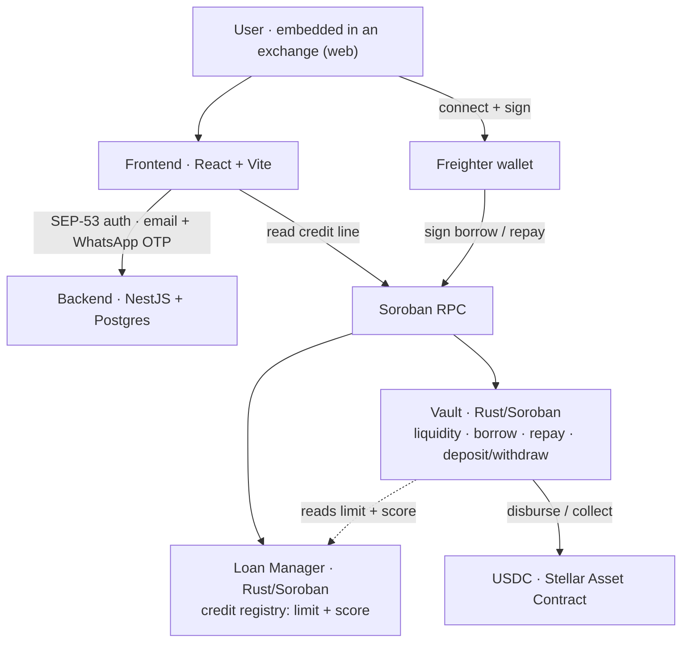
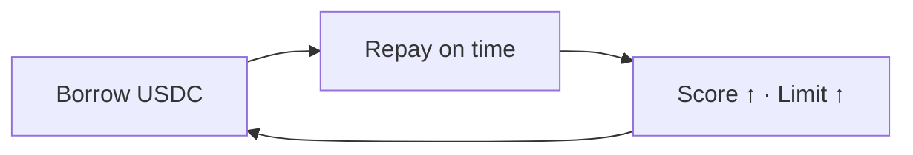

# Lendoor · Stellar

**Embedded, uncollateralized credit for Latin America's credit-invisible — built on Stellar.**

Built for the **PULSO Hackathon** (NearX × Stellar Development Foundation, Argentina track).

Lendoor is the credit layer a wallet plugs into to extend uncollateralized, on-chain credit to the **186M+ adults** in LatAm the formal system can't score. The full lifecycle — **borrow → repay → score** — runs on **Soroban** and is **live end-to-end on Stellar testnet**.

### Links

- 🟢 **Live app:** https://stellar.lendoor.xyz/borrow
- 🎥 **Demo video:** https://youtu.be/ga_5pt-i9Ns
- 🐦 **Project:** [@LendoorProtocol](https://x.com/LendoorProtocol) · **Founder:** [@lucho_leonel1](https://x.com/lucho_leonel1)

> To try it: connect **Freighter** on **Test Net** and run a borrow → repay. (Testnet XLM via [friendbot](https://friendbot.stellar.org).)

---

## The bet

There is a live version of Lendoor already running on Celo, distributed inside the **Lemon** wallet. This project makes the same move on a different stack:

> **Lemon on Celo → Bitso on Stellar.**

Same thesis (embedded credit for the credit-invisible), swapped to the rails where it can scale fastest in the region: an exchange like **Bitso** as the distribution surface, and **Stellar + USDC** as the money rail.

## Why now (and why Stellar)

- **186M+ credit-invisible adults** in LatAm — people the formal system can't underwrite, so they never get credit.
- The payment rails are getting solved (Argentina's **Transferencias 3.0**, the region's high demand for **digital dollars**). The missing layer is **credit on top of those rails**, for people no one can score without collateral.
- Stellar gives us cheap, ~5s USDC settlement and a real LatAm anchor/wallet ecosystem to reach those users.

## How it works

1. **Onboard once.** The user connects a Stellar wallet (Freighter) and verifies via email + WhatsApp OTP. *In production this is replaced by the exchange's existing KYC — the user is already identity-verified, so there's no separate onboarding.*
2. The protocol issues a small **uncollateralized** loan on Stellar, sized by the user's on-chain credit limit, disbursed instantly.
3. Repaying on time **raises the limit** — a credit ladder that compounds trust.
4. The repayment history becomes a **portable on-chain credit score** that travels with the user across integrations.

The hard, defensible part is not the lending pool. It is **underwriting the invisible without collateral**: limits start tiny and grow only with on-time repayment (exposure is always *earned* and capped), recovery rides identity + score consequences instead of seizing assets, and the repayment data is **portable and on-chain**.

## Architecture



The credit lifecycle, as a compounding loop:



## Stellar integration (load-bearing, not on a slide)

The entire credit protocol runs on Stellar — it is the integration, not a bolt-on:

- **Soroban smart contracts (Rust):** two composed contracts in `contratos/` — a **Vault** (liquidity + uncollateralized borrow/repay/deposit/withdraw, ERC-4626-style) and a **Loan Manager** (per-wallet credit limit + score). The full borrow → repay → score lifecycle runs on-chain.
- **Freighter** for wallet connect and transaction signing; **SEP-53 signed messages** for backend auth.
- **`@stellar/stellar-sdk` + Soroban RPC** for contract invocation and reads; contracts deployed and seeded with the **Stellar CLI**.
- **Settlement in USDC** (Stellar Asset Contract) for disbursement and repayment.

### Live on testnet

| Contract | Address |
|---|---|
| Vault | `CDEJOQBQEZ7LUXSWXM4RF6EPBZLMJHMTGKC5GNWK5TNJR36TBHQLCULP` |
| Loan Manager | `CDIHUCP6DWKW7B6IUECP3SCK5WCI3W5ITNQDZEK2TNI55WLXDM6Y4WJJ` |
| USDC (SAC) | `CDLZFC3SYJYDZT7K67VZ75HPJVIEUVNIXF47ZG2FB2RMQQVU2HHGCYSC` |

> On testnet the settlement asset is the **native XLM Stellar Asset Contract standing in for USDC** (6-decimal accounting); on mainnet this is Stellar USDC. The contract logic is asset-agnostic.

## Repo structure

```
lendoor-stellar/
├── frontend/    # Lendoor web app — Freighter + Soroban wired (borrow, repay, lend, account)
├── backend/     # NestJS — SEP-53 wallet auth, email + WhatsApp OTP, blockchain sync, Postgres
├── contratos/   # Soroban smart contracts (Rust): vault + loan-manager (+ tests, parity & migration docs)
├── packages/    # generated Soroban TypeScript bindings (vault-client, loan-manager-client)
├── shared/      # types shared across frontend/backend
└── specs/       # thesis, Stellar integration, customer discovery, submission checklist
```

- **frontend/** — React + Vite. The wallet/contract layer targets Stellar: `src/lib/stellar-wallet.ts` (Freighter) and `src/lib/stellar-contracts.ts` (Soroban calls). Borrow, repay, the account funds block (deposit/withdraw to the vault) and the lend market all run against Soroban.
- **backend/** — NestJS, pruned to the base: SEP-53 wallet login, real email (ZeptoMail) + WhatsApp (Kapso) OTP, chain sync, DB persistence (TypeORM + Postgres).
- **contratos/** — the Rust contracts, with a test suite, `PARITY.md` (EVM↔Soroban equivalence) and `MIGRATION_EVM_TO_SOROBAN.md`.

## Tech stack

Rust / Soroban · `@stellar/stellar-sdk` · Freighter · React + Vite + TypeScript · NestJS + TypeORM + Postgres · Docker.

## Status

- ✅ **Live:** Soroban contracts on testnet; full borrow → repay → score lifecycle; Freighter auth; email + WhatsApp OTP onboarding; vault deposit/withdraw; web app at `stellar.lendoor.xyz`.
- 🛣️ **Roadmap:** mainnet USDC, anchor on/off-ramp (SEP-24/31), external LPs, the identity-based recovery layer (reminders / AI voice), and the in-exchange KYC handoff.

## Team & origin

Built by Argentine builders shipping on Stellar. Derived from the live Lendoor codebase (Celo/EVM, real loans on mainnet) — this is the Stellar-native build for PULSO.
