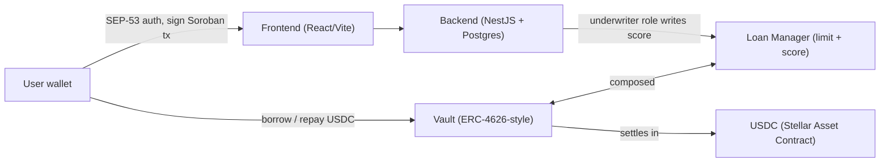
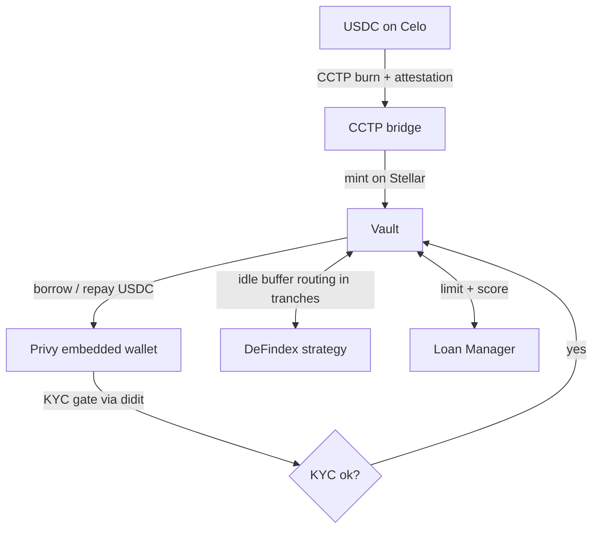

# Lendoor on Stellar — Technical Architecture & Integration Plan

**SCF #45 · Build Award · Integration Track.** Building blocks integrated: **Circle CCTP · Privy · DeFindex**.

Lendoor is an uncollateralized on-chain credit protocol. The `borrow → repay → score` lifecycle runs on **Soroban** and settles in **USDC (Stellar Asset Contract)**. The same protocol runs in production on Celo (EVM); this document covers the **Stellar/Soroban** deployment and the plan to integrate the three chosen building blocks. It is live end-to-end on Stellar testnet today.

---

## 1. System architecture (Soroban)

Two composed Soroban contracts:

- **Vault** — pooled liquidity + uncollateralized `borrow / repay / deposit / withdraw`. ERC-4626-style (OpenZeppelin virtual-shares form), issues shares to LPs. Includes in-place `upgrade`, TTL/state management, and an inflation-offset guard.
- **Loan Manager** — per-wallet credit `limit` + `score`. The off-chain risk model signs and writes the score through an `underwriter` role; the model itself stays off-chain and proprietary. The on-chain record is the portable, verifiable artifact.
- **Roles:** `admin` (config/upgrade), `underwriter` (writes score), `operator` (liquidity rebalancing), `pauser`.
- **Access path:** frontend (React + Vite) signs Soroban transactions; backend (NestJS + Postgres) handles **SEP-53** wallet auth; on-chain access via `@stellar/stellar-sdk` + Soroban RPC.

---

## 2. Integration plan

### 2.1 Circle CCTP — cross-chain USDC liquidity

Brings external USDC from Celo into the Vault, unifying liquidity across deployments and opening the pool to external LPs.

- `depositForBurn` of USDC on Celo (CCTP source domain).
- Backend polls Circle's attestation service for the burn attestation, with retry and idempotent reconciliation keyed by the CCTP nonce.
- The attestation is submitted to the CCTP contract on Stellar to **mint USDC directly into the Vault**; Vault share accounting is updated for the LP.
- **Deliverable:** a testnet transaction bridging USDC via CCTP into the Vault + PR. Mainnet cutover in T3.

### 2.2 Privy — embedded-wallet onboarding

Lets a borrower onboard without seed-phrase friction and sign Soroban transactions.

- User authenticates with email / social / passkey via the Privy SDK; Privy provisions a self-custodial **Stellar keypair**.
- First-use setup creates the account and establishes the **USDC trustline** (`changeTrust`).
- Privy signs the Soroban transaction auth entries for `borrow` / `repay`; signed XDRs are submitted via Soroban RPC.
- The wallet address is bound to its Loan Manager record (limit + score).
- **Deliverable:** a testnet run of a user onboarding via Privy and signing a Soroban transaction + PR.

### 2.3 DeFindex — idle-liquidity capital efficiency

Protocol treasury / capital efficiency, **not a retail yield product**.

- The Vault keeps a small **idle buffer**; excess idle USDC is deposited into a **DeFindex vault/strategy** (receiving DeFindex shares) through its Soroban interface.
- An `operator`-triggered rebalance keeps idle at or below the buffer: deposits in **fixed tranches**, withdraws in tranches on borrow demand, so the Vault can always serve a loan.
- **Worked example:** $10,000 Vault liquidity, $3,000 lent → ~$7,000 into DeFindex in $1,000 tranches; withdrawn $1,000 at a time as borrows grow, idle-but-uninvested stays ≤ ~$1,000.
- Yield accrues to the Vault (protocol / LPs), reflected in share price.
- **Deliverable:** a testnet run — idle USDC into DeFindex, yield accrual visible, funds pulled back to serve a borrow.

---

## 3. Supporting components

- **KYC gate (didit):** a wallet must pass identity verification before `borrow` is enabled.
- **Indexer (off-chain, proprietary):** ingests contract events via Soroban RPC `getEvents` (durable cursor, backfill, retention-window handling), reconciles on-chain state to the database, and powers monitoring/alerting.
- **Hardening (for LP-fund custody):** multisig + timelock on admin/upgrade, emergency pause, least-privilege roles, a real decimals-offset + enforced seed deposit, and checked/`mul_div` math. Completed before audit; audited via the Soroban Audit Bank.
- **Open source:** the Vault + Loan Manager contracts are open-sourced under Apache-2.0 in this repository; the risk model and indexer stay off-chain/proprietary.

---

## 4. On-chain footprint (registered at award time)

- **Stellar testnet (live now):** Vault `CDEJOQBQEZ7LUXSWXM4RF6EPBZLMJHMTGKC5GNWK5TNJR36TBHQLCULP` · Loan Manager `CDIHUCP6DWKW7B6IUECP3SCK5WCI3W5ITNQDZEK2TNI55WLXDM6Y4WJJ`.
- **Stellar mainnet (deployed in T3, IDs registered at deploy):** hardened + audited Vault and Loan Manager contract IDs, the USDC Stellar Asset Contract, the `operator` / `underwriter` accounts, and the admin multisig account.

---

## 5. Final-tranche on-chain metric + methodology

- **Metric:** ≥ 100 loans originated to distinct KYC-verified borrowers on Stellar mainnet.
- **Definition:** unique loan-disbursement events emitted by the mainnet Loan Manager contract, to distinct borrower wallets, each KYC-gated (so the count is not sybil-inflatable).
- **Window:** 4 weeks from the mainnet cutover (T3 / D3.2).
- **Verification:** the deployed Loan Manager contract ID on Stellar.Expert, plus a public query over its disbursement events.
