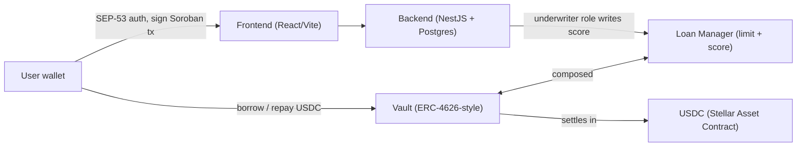
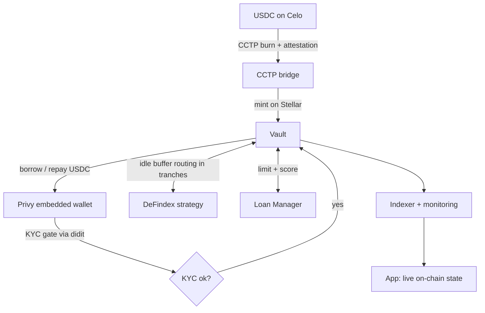

# Lendoor on Stellar — Technical Architecture & Integration Plan

**Project:** Lendoor — uncollateralized, on-chain credit.
**SCF #45 · Build Award · Integration Track.**
**Building blocks integrated:** Circle CCTP · Privy · DeFindex.

This document is Stellar-specific and focuses on **how we integrate the three chosen building blocks** into a credit protocol that is already live end-to-end on Stellar testnet (and running at scale on Celo mainnet with real loans).

---

## 1. What Lendoor is

Lendoor lets a user borrow USDC **without collateral**, priced on on-chain and alternative data instead of a deposit. The full `borrow → repay → score` lifecycle runs on **Soroban**. A per-wallet credit limit and score grow only with on-time repayment, and live on-chain as a portable, verifiable record.

- **Live today on Stellar testnet** (verifiable on Stellar.Expert):
  - Vault: `CDEJOQBQEZ7LUXSWXM4RF6EPBZLMJHMTGKC5GNWK5TNJR36TBHQLCULP`
  - Loan Manager: `CDIHUCP6DWKW7B6IUECP3SCK5WCI3W5ITNQDZEK2TNI55WLXDM6Y4WJJ`
- **Live at scale on Celo mainnet** (same protocol, EVM): 4,576 uncollateralized loans to 1,174 borrowers, ~$38K originated, ~90% matured-cohort repayment.

This Build brings the protocol to **Stellar mainnet** for crypto-native borrowers, with liquidity seeded by the team and institutional LPs.

---

## 2. Current on-chain architecture (Soroban)

Two composed Soroban contracts run the credit lifecycle, settling in **USDC (Stellar Asset Contract)**:

- **Vault** — liquidity + uncollateralized `borrow / repay / deposit / withdraw`. ERC-4626-style, OpenZeppelin virtual-shares form. In-place `upgrade`, TTL/state management, inflation-offset guard.
- **Loan Manager** — per-wallet credit limit + score. The off-chain risk model signs and writes the score via an **underwriter role**; the model stays off-chain and proprietary. The on-chain record is the portable artifact.

Off-chain: frontend (React + Vite) connects the wallet and signs Soroban transactions; backend (NestJS + Postgres) handles **SEP-53** wallet auth; access via `@stellar/stellar-sdk` + Soroban RPC.

---

## 3. Integration plan (Integration Track)

### 3.1 Circle CCTP — cross-chain USDC liquidity

**Goal:** bring external USDC liquidity from Celo (where Lendoor already operates) onto Stellar, into the Vault, and open the pool to external LPs.

**How:**
1. USDC is **burned on the source chain (Celo)** via the CCTP TokenMessenger.
2. Circle issues an **attestation** for the burn.
3. Our backend polls the Circle attestation service, handles retries and idempotent reconciliation, and submits the **mint on Stellar** so USDC lands directly in the Vault (as a Stellar Asset Contract balance).
4. LP accounting is updated against the Vault's share logic.

**Deliverable measure:** a testnet transaction bridging USDC via CCTP into the Vault, plus the PR. Mainnet cutover in T3.

### 3.2 Privy — embedded-wallet onboarding

**Goal:** let a borrower onboard without seed-phrase friction and sign Soroban transactions.

**How:**
1. User signs in with **email / social / passkey** through the Privy SDK; Privy provisions a **Stellar wallet** (keys held under Privy's self-custodial model).
2. On first use we handle account setup and the **USDC trustline** so the wallet can hold and move USDC.
3. The wallet **signs Soroban transactions** (borrow / repay) through Privy; signed XDRs are submitted via Soroban RPC.
4. The wallet address is bound to the user's Loan Manager record (limit + score).

**Deliverable measure:** a testnet run of a user onboarding via Privy and signing a Soroban transaction, plus the PR.

### 3.3 DeFindex — idle-liquidity capital efficiency

**Goal:** keep the Vault's liquidity productive without offering a retail yield product. This is **protocol treasury / capital efficiency**, not a retail earn feature.

**How:**
1. The Vault holds a small **idle buffer** (e.g. keep ≤ $1,000 idle).
2. Excess idle USDC is routed into a **DeFindex vault/strategy** in **fixed tranches** (e.g. $1,000 at a time) via DeFindex's Soroban contract interface.
3. On **borrow demand**, liquidity is pulled back from DeFindex in tranches so the Vault can always serve a loan; idle capital never exceeds the buffer.
4. Yield accrues to the protocol (team + institutional LPs), reflected in Vault accounting.

**Worked example:** with $10,000 of Vault liquidity and $3,000 out on loans, the remaining ~$7,000 is deployed into DeFindex in $1,000 tranches; as borrow demand rises, tranches are pulled back $1,000 at a time so the idle-but-uninvested balance stays at or below the ~$1,000 buffer. Protocol capital stays productive without ever failing to serve a borrow.

**Deliverable measure:** an end-to-end testnet run — idle USDC deposited into DeFindex, yield accrual visible, funds pulled back to serve a borrow.

---

## 4. Supporting components (off-chain / hardening)

- **KYC gate (didit):** identity verification is required before a wallet can borrow on mainnet. Off-list supporting infrastructure.
- **Production indexer (proprietary, off-chain):** ingests contract events via Soroban RPC (`getEvents`) with durable cursor + backfill + retention-window handling, reconciles on-chain state against the database, syncs the loan lifecycle / score / limit, deduplicates, classifies on-time vs late, and powers on-chain monitoring/alerting.
- **Production hardening (for LP-fund custody):** multisig + timelock on admin/upgrade, emergency pause, least-privilege roles (admin / underwriter / operator / pauser), a real decimals-offset + enforced seed deposit, and checked/`mul_div` math. Hardened before audit.
- **Audit:** hardened contracts submitted to the **Soroban Audit Bank** (audit is $0 to the grant); findings remediated before mainnet.
- **Open source:** the Vault + Loan Manager contracts are open-sourced under **Apache-2.0** in this repository. The risk model and indexer remain off-chain and proprietary.

---

## 5. Why Stellar meaningfully improves the product

Micro-credit only works on cheap rails. Stellar's **sub-cent fees and ~5s USDC settlement** make loans as small as **1–5 USDC** economically viable, where EVM gas would eat the margin. The loan itself runs on Soroban — this is a load-bearing integration, not a cosmetic bolt-on. CCTP + Privy + DeFindex are what turn an on-chain vault into a product borrowers can onboard into and fund, with protocol liquidity kept capital-efficient.

---

## 6. Delivery + committed mainnet metric

- **T1 (MVP, testnet):** CCTP live on testnet · Privy onboarding · KYC gate (didit).
- **T2 (testnet production + yield):** Privy wired end-to-end · DeFindex idle-buffer routing · contract hardening · threat model + on-chain monitoring plan · submit to Audit Bank.
- **T3 (audited mainnet):** post-audit remediation · CCTP + Privy + DeFindex mainnet cutover · production indexer + monitoring · validation user testing.

**Committed on-chain metric (T3):** ≥ 100 loans originated (unique disbursement events of the mainnet Loan Manager contract) to distinct KYC-verified borrowers on Stellar mainnet, measured over a 4-week window from the mainnet cutover, verifiable via the deployed Loan Manager contract ID on Stellar.Expert plus a public query.
